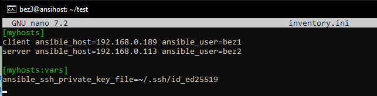

### Предварительная настройка

Для выполнения задания создадим три виртуальные машины:
```
1. bez3@ansihost - на которой будет установлен ansible 
2. bez2@server = 192.168.0.122 
3. bez1@client =192.168.0.110
```

И прокидываем ssh соединение между ними. На хосте создаем ssh-ключ и копируем его публичную часть на остальные машины с помощью команд:
```
ssh-keygen -t ed25519 -C "ansible"
ssh-copy-id -i ~/.ssh/id_ed25519.pub bez2@192.168.0.122 
ssh-copy-id -i ~/.ssh/id_ed25519.pub bez1@192.168.0.110
```

После загрузки ansible создаем простой inventory.ini для проверки связи



И пингуем наши машины. В ответ на запрос получаем pong, значит соединение и аутентификация настроены правильно.


### Создание проекта

Создаем структуру проекта:


После чего определим роли для клиента и сервера.


Создаем tasks для каждого из них где поочередно прописываем задачи, которые требуется выполнить:


Проект для развертывания готов. Копируем его на `bez3@ansihost` с помощью scp и запускаем playbook.


Как видно из фото выше - запуск прошел успешно. Теперь запустим и проверим веб-приложение перейдя по адресу: http://192.168.0.110:3000/


